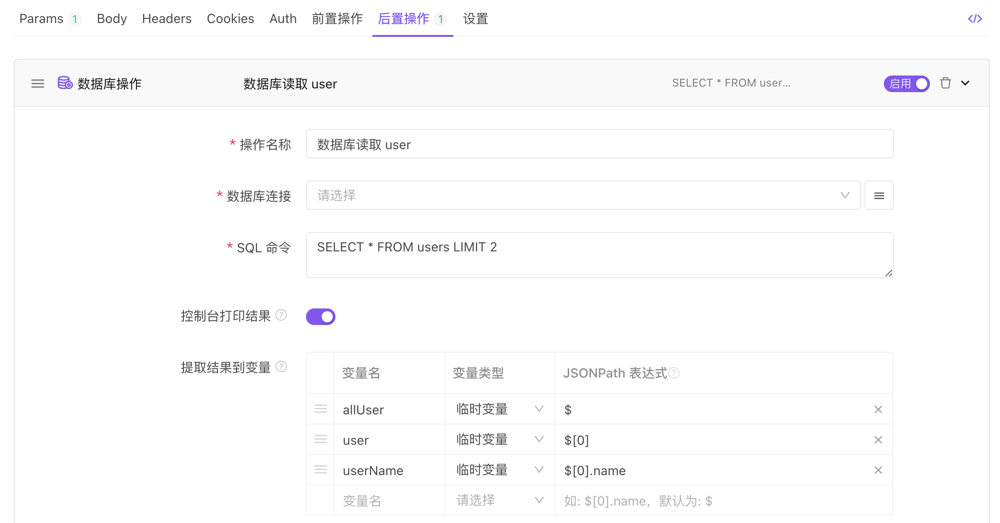

# 数据库操作

`前置操作`、`后置操作`支持添加`数据库操作`，可读写数据库数据，查询结果可在接口请求参数、断言、自定义脚本等场景中使用。目前支持`MySQL`、`SQL Server`、`Oracle`、`PostgreSQL`，未来会支持更多数据库类型。

## 示例

::: v-pre

1. 在`前置操作`里添加`数据库操作`
2. SQL 为 `SELECT * FROM user LIMIT 2`。
3. 将查询结果提取到 3 个变量：`allUser`，`user`，`userName`。

:::



#### 说明

::: v-pre

假设 SQL 查询结果数据为：

```json
[
  {
    "id": 1,
    "name": "jack"
  },
  {
    "id": 2,
    "name": "peter"
  }
]
```

则提取到的变量值分别为如下：

1. 临时变量`allUser`的值是`数组`类型，值为：

   ```json
   [
     {
       "id": 1,
       "name": "jack"
     },
     {
       "id": 2,
       "name": "peter"
     }
   ]
   ```

2. 临时变量`user`的值是`对象`类型，值为：

   ```json
   {
     "id": 1,
     "name": "jack"
   }
   ```

3. 临时变量`userName`的值是`字符串`类型，值为：

   ```
   jack
   ```

### 变量使用提示

使用变量时，读取对象或数组类型变量里的属性值写法为`{{allUser[0].name}}`或`{{user.name}}`，遵循`JSON Path`语法规范，只需将`JSON Path`里的`$`符号替换为`变量名`既可。

:::

更多变量使用方法请[查看文档](/api-manage/variables)。
