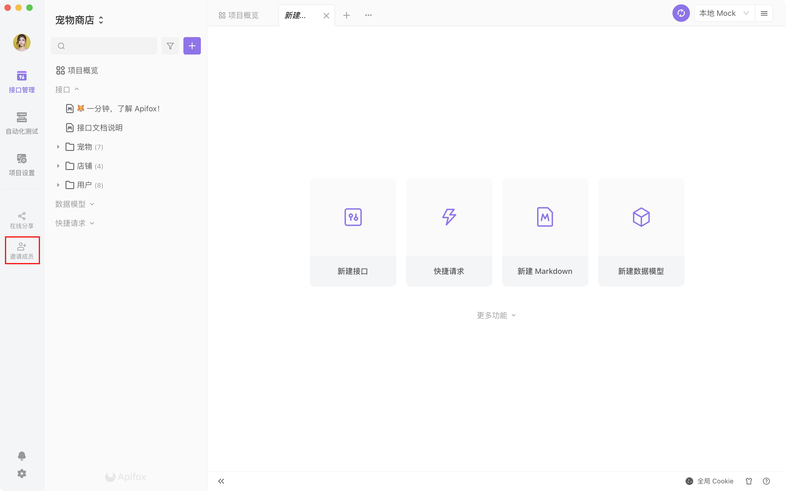

# 邀请成员

在你了解了 [团队权限](../team-permission/) 和 [团队协作流程](/best-practices/workflow/) 后，就可以邀请你的小伙伴加入团队了。

## 如何邀请

1. 当你已经打开项目时，可以点击左侧的 「邀请成员」，进行邀请。

2. 也可以在团队页面，点击 「成员/权限」->「邀请成员」，进行邀请。

## 邀请设置

您可以设置邀请对象参与当前团队的哪些项目，并设置成员的权限，详情可以看 [团队权限](../team-permission/) 。

## 邀请方式

### 链接邀请

如果你的邀请对象还没有注册 Apifox 账号，可以点击「复制邀请链接」，将链接发送给邀请对象 ，在有限期内，邀请对象可以通过注册，加入团队、加入项目。不限人数。

如果想撤销发出去的邀请链接，可以点击右下角的「重置链接」，则之前分享出去的邀请链接将失效。

### 邮箱邀请

你也可以向邀请对象的工作邮箱发送邀请。一次最多可以邀请 50 个邮箱。

### 账号邀请

如果你的邀请对象已经注册 Apifox 账号，可以直接输入他的账号/邮箱，直接邀请。一次只能输入一位成员。

