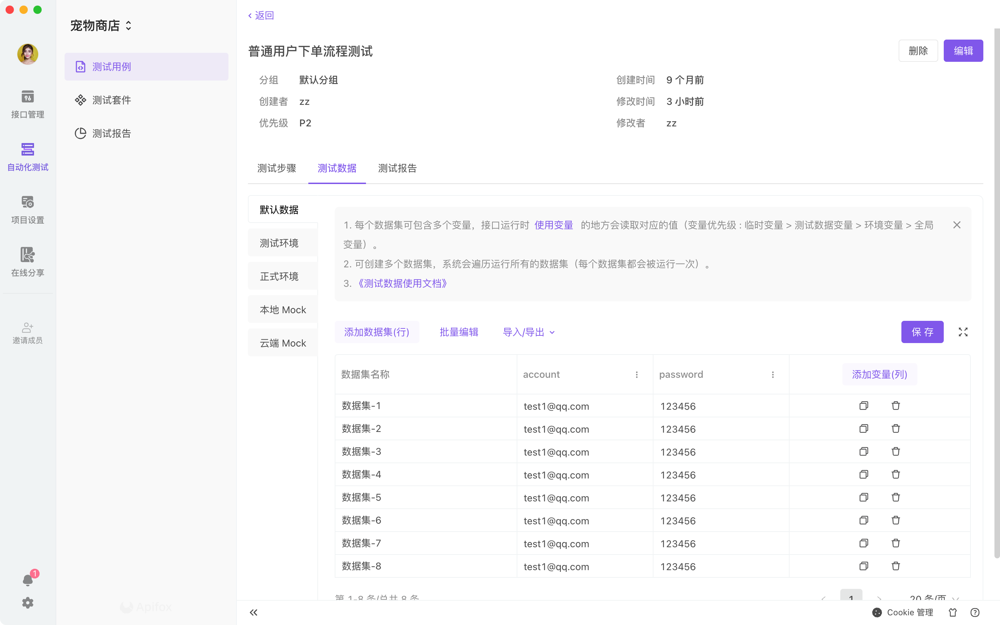
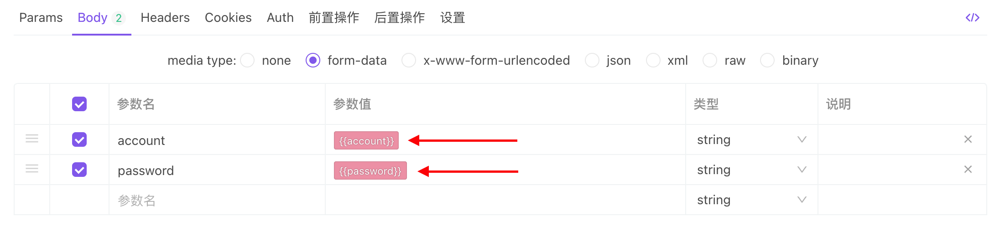
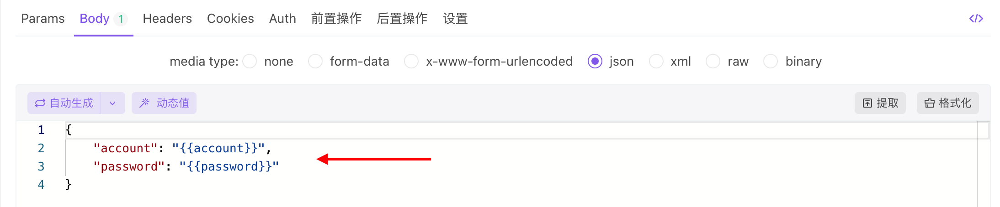
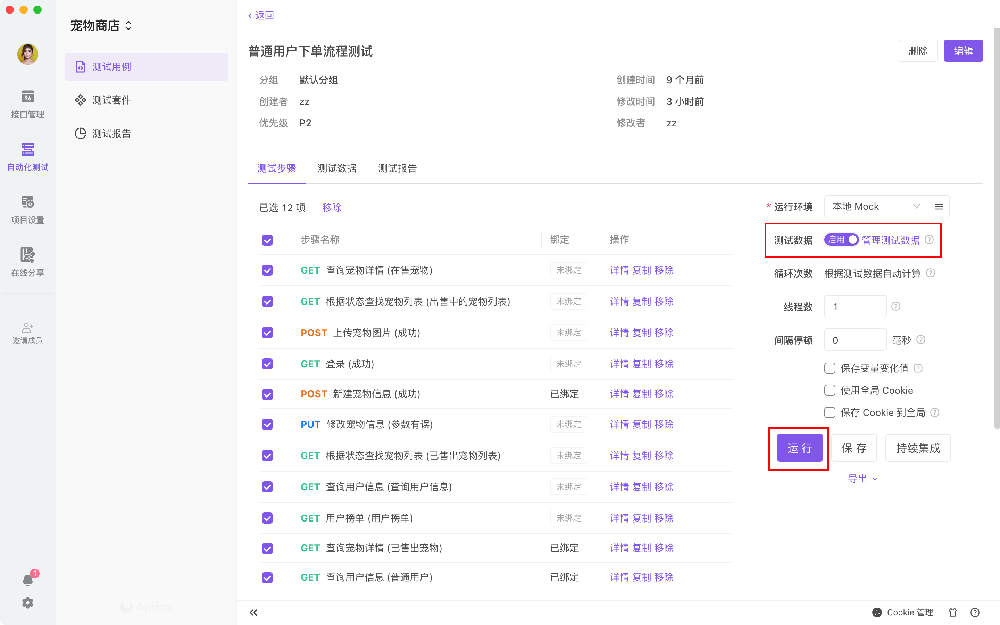

# 测试数据

`测试用例`和`测试套件`支持测试数据集。当用例或套件运行时，系统会循环运行数据文件里所有的数据集，并且会将数据集里的数据赋值给对应的变量。

1. 每个数据集可包含多个变量，接口运行时 [使用变量](/api-manage/variables) 的地方会读取对应的值（变量优先级：临时变量 > 测试数据变量 > 环境变量 > 全局变量）。
2. 可创建多个数据集，系统会遍历运行所有的数据集（每个数据集都会被运行一次）。
3. 数据集云端同步，成员之间共享测试数据。
4. 可根据不同环境设置不同的数据集。

#### 编辑测试数据

打开测试用例或测试套件详情页就可以看到测试数据页。通过`添加数据集`、`批量编辑`、添加变量等直接编辑测试数据；点击`导入`可以导入本地`csv`文件的数据。

#### 使用测试数据

测试步骤导入的接口或用例，通过引用变量的方式获取测试数据。

#### 运行测试数据

在运行前需要打开`测试数据`的开关，再点击`运行`

### 常见问题

#### 1. 中文导入后乱码的问题

是因为 windows 默认导出 csv 是 GBK，并且旧版本的 Excel 2016 前会不保存 Bom (byte order mark)。

- Windows 可以使用记事本打开 csv 文件后另存为 utf-8 格式。
- Mac 上可以使用 `iconv -f GBK -t UTF-8 xxx.csv > utf-8.csv`。
