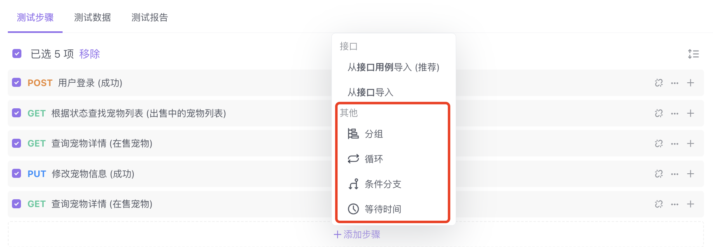
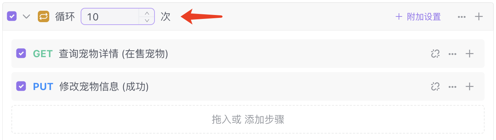
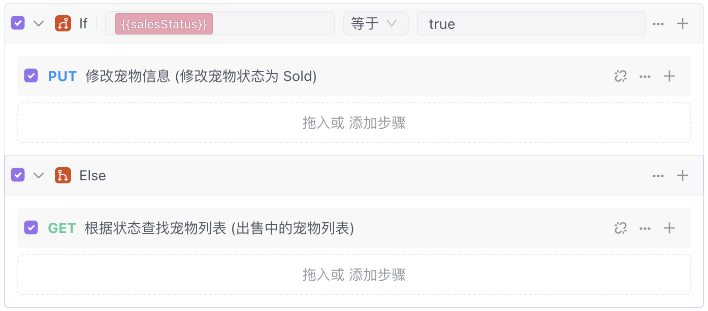
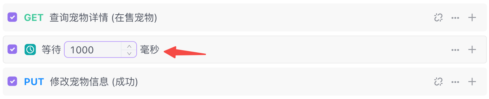
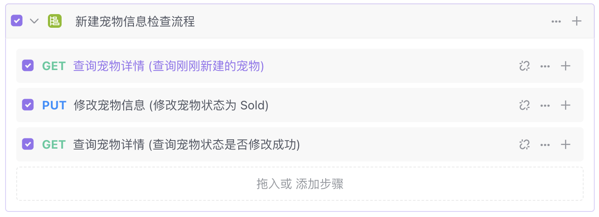

# 测试流程控制

借助测试流程控制，开发者可以在测试步骤中新增流程控制条件（循环、判断、等待、分组）等。进一步满足了更复杂的测试场景/流程配置的使用，
最终借助自动化测试功能解决复杂场景的测试工作。

### 循环

当测试步骤需要重复执行时，可以通过设置循环次数来解决。同时，循环的附加设置中，支持自定义设置 `中断条件/遇到错误时` 判断。

示例：宠物店店主在结束营业的晚上，登录宠物库存管理后台，将今日出售的 10 个宠物，分别进行详情查看并将它的在售状态变为已售出。

- 1. 点击底部的按钮「添加步骤」，并选择「循环」。

- 2. 输入需要的循环次数 10 。

- 3. 将该测试步骤拖入该条件下内框中（你也可在该条件下直接添加测试步骤）。

### 判断

当测试流程中存在多条件判断时，可以通过添加判断条件（ If ）来区分流程执行的步骤。即当判断配置的条件满足时，该判断条件下的子步骤才会执行, 相反子步骤则会被跳过。

示例：宠物店店主根据昨日宠物出售情况，若判断为售出，将该宠物的出售状态设置为“已售出”。否则( else )，查询在售中列表。

- 1. 点击底部的按钮「添加步骤」，并选择「条件分支」。

- 2. 在 lf 条件后面的输入框填写请求接口得到的变量 saleStatus ，然后选择条件"等于"，最后输入比较数值为 true。(当销售状态判断为 true 的时候，则更改宠物信息为「已售出」)

- 3. 将鼠标悬浮在该条件分支操作拦会出现「＋ Else 」，点击并新增「出售中的宠物列表」步骤（否则，即查询在售中的宠物列表。）。

- 4. 将测试步骤拖入到相应的条件分支中。

### 等待

当测试流程中某个步骤需要执行后需要等待一段时间时，比如 A 步骤需要等待若干时间后再执行 B 步骤，可以通过新增等待条件来解决。

示例：模拟用户查看宠物详情，浏览 1000ms 后，将该宠物详情信息中的浏览状态进行更新。

- 1. 点击底部的按钮「添加步骤」，并选择「等待」。

- 2. 输入需要等待的时间 1000（单位毫秒）。

### 分组

当测试流程中多个步骤存在相关联关系时，可以进行归类并放入到同一个分组中。通过对测试步骤的分组，让测试用例具备更好的可读性和操作性。

示例： 将查看详情宠物详情、修改宠物信息、再次查看详情等步骤归类成分组。

- 1. 点击底部的按钮「添加步骤」，并选择「分组」。

- 2. 将要归类的步骤，拖到分组步骤下或在分组中直接添加步骤。

