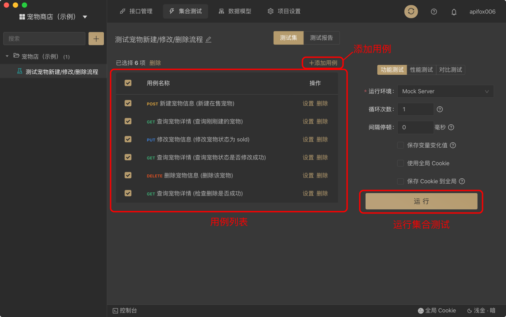
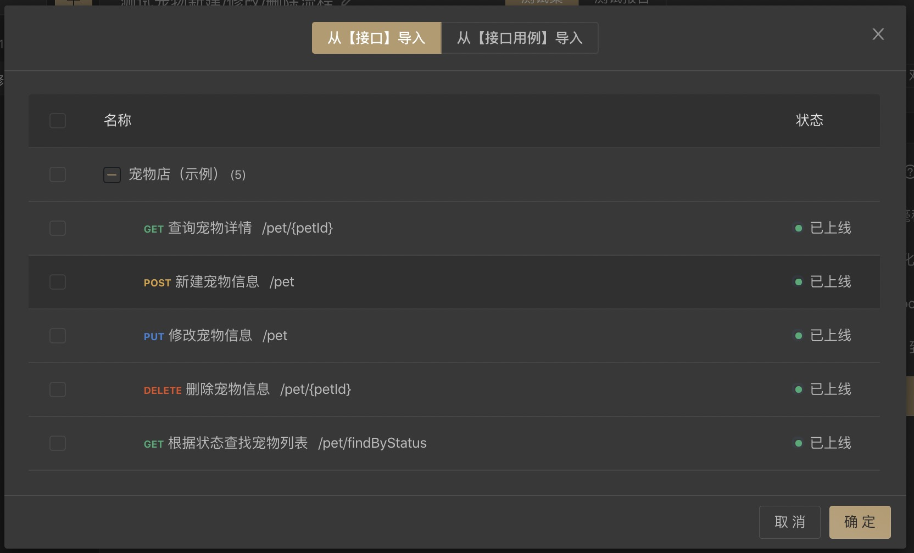

# 功能测试

集合测试是将多个`接口用例`有序地组合在一起运行，用来测试一个完成的业务流程。



## 添加用例



添加用例有两种方式：`从接口导入`和`从接口用例导入 (推荐)`

- 从【接口】导入：根据接口参数自动生成一个用例，其参数值为空，需要手动填写。
- 从【接口用例】导入：将接口用例以`复制`的方式导入，接口用例里的参数也会一同复制过来。

::: tip 注意

- `从接口导入`后，需要手动设置接口参数，否则运行的时候，接口参数是空的。
- `从接口用例导入`后，会同步导入接口用例里的参数，会方便很多。
- `从接口用例导入`采用的是`复制`的方式，而不是`引用`的方式，所以导入后的用例，和原来的`接口用例`是相互独立的，各自改动后互不影响。

:::

## 测试数据

支持 csv 格式测试数据，用法和 Postman 一样：

1. csv 第一行填变量名
2. csv 第二行开始填写变量值
3. 运行的时候，系统会从第二行开始遍历循环运行，运行的时候会将对应列的值赋给对应的变量

## 常见问题

::: v-pre

### B 接口请求参数依赖于 A 接口返回的数据，如何实现？

使用`后置脚本`和`临时变量`（或环境变量/全局变量）。

1. A 接口的用例里编写`后置脚本`，将接口请求返回的数据写入`环境变量`，示例：

   ```javascript
   // 获取 JSON 格式的请求返回数据
   var jsonData = pm.response.json();

   // 将 jsonData.token 的值写入临时变量
   pm.variables.set('token', jsonData.token);
   ```

2. B 接口对应的参数值，设置为对应的变量，如`{{token}}`，即可直接引用前面设置的环境变量`token`的值。
