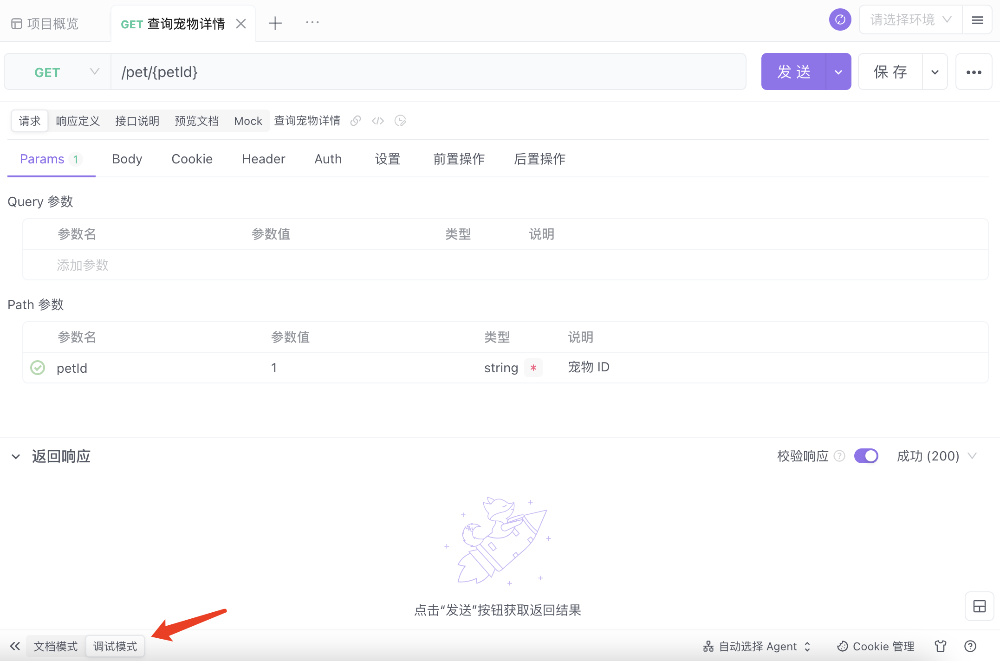

## 调试模式

在项目开发初期，考虑到交付速度，开发人员会在制定业务需求之后直接进行代码开发，最终再通过代码生成 API 文档，即`Code First`。而基于这种场景考虑，我们推出了`调试模式`。
当你在开发完业务代码之后，可以在调试模式下直接快捷地测试接口，并生成接口文档。

### 使用场景

- 习惯先对接口进行参数测试后，再生成接口文档

### 操作步骤

- 点击 「新建接口」，点击页面底部的「调试模式」，输入服务 URL ，添加或修改参数，点击「发送」调试。
   

- 点击「保存」，然后切换为「预览文档」视图

 

### 调试模式与文档模式的区别

- 调试模式：只需要编辑界面中接口参数，修改后即可直接发送请求，保存后可以生成文档。

- 文档模式：先要定义文档并保存，再调试接口。同时，当接口需要变更时，需要修改文档中的定义后再调试。
